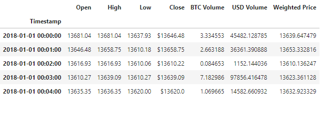
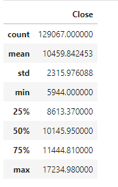
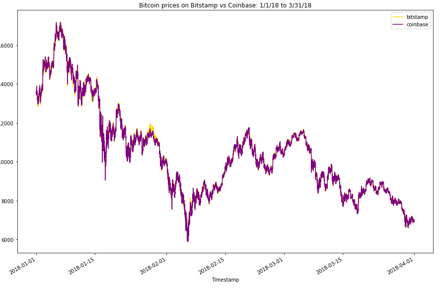
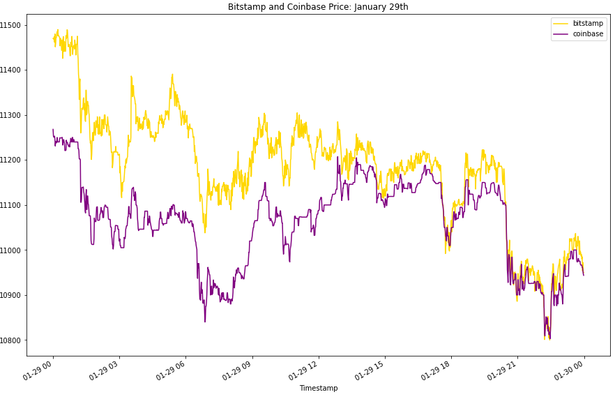
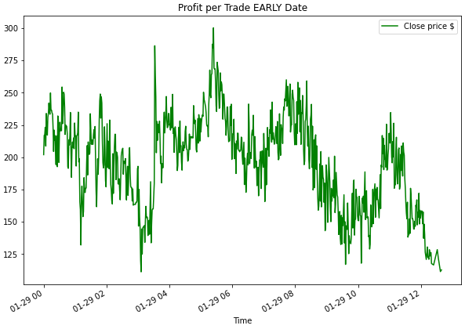

# Visualizing BTC Arbitrage Profits

<!-- TABLE OF CONTENTS -->

  
Table of Contents

  <ol>
    <li>
      <a href="#purpose">Purpose</a>
      <ul>
        <li><a href="#inputs">Inputs</a></li>
        <li><a href="#outputs">Outputs</a></li>
      </ul>
    </li>
    <li>
      <a href="#technologies">Technologies</a>
      <ul>
        <li><a href="#python">Python</a></li>
        <li><a href="#csv">CSV</a></li>
        <li><a href="#pandas">Pandas</a></li>
        <li><a href="#matplotlib">Matplotlib</a></li>
      </ul>
    </li>
    <li><a href="#version-release">Version Release</a></li>
    <li><a href="#how_to_run">How to run</a></li>
    <li><a href="#usage">Usage</a></li>
    <li><a href="#contributors">Contributors</a></li>
    <li><a href="#license">License</a></li>
        <ul>
        <li><a href="#permissions">Permissions</a></li>
        <li><a href="#disclaimer">Disclaimer</a></li>
        </ul>
    </li>
    <li><a href="#aknowledgements">Aknowledgements</a></li>

<!--Purpose -->
## Purpose
This model presents visualizations of BTC prices in Bitstamp and Coinbase between January to March of 2018. The model aims to highlight profitability opportunities though arbitrage tactics. 

### Inputs
The application reads financial data from 2 files containing trade prices form the exchanges of Bitstamp and Coinbase. Each file contains data points such as Timestamp, Open, High, Low, Close, BTC Volume, USD Volume, and Weighted Price.
The analysis focuses on Timestamp and price at Closing. File names provided:

    timestamp.csv

    coinbase.csv

### Outputs
    Statistical analysis of BTC prices on each exchange Bitstamp and Coinbase data.
    Visualizations of the price over time for each exchange to derive trends, and profitability opportunities through arbitrage tactics for specif time points.
    Profitability calculations.
    

---
<!--Technologies -->
## Technologies
### Python:

    Phyton Version: **3.7.13**

### CSV:
[csv](https://docs.python.org/3/library/csv.html)

### Pandas
[Pandas](https://pandas.pydata.org/pandas-docs/stable/reference/api/pandas.DataFrame.html) 

### Matplotlib
[Matplotlib](https://matplotlib.org/stable/api/_as_gen/matplotlib.pyplot.plot.html)

---
<!--How to run -->
## How to run

1. Clone the repository on a folder that will easy to open
2. File was developed with Jypiter Notebook and Lab
3. Open the file with Jupiter through the Anaconda Navigator
4. Navigate open the folder where the files were cloned to
5. Open the file on JupterLab

---
<!--Version Release -->
## Version Release

### Version 1.0

---
<!--Usage -->
## Usage

### Price data from Bitstamp - sample:

### Price statistics from Bitstamp - sample:

### Price comparison trend visualization - sample:

### Visualization focused on a specific date - January 29th 2018 - sample:

### Visualization of profit per trade on a specific date - January 29th 2018 - sample:

---
<!--Contributors -->
## Contributors

Jeremy Vargas

    Managing Director
    Resonant Solutions LLC
    email:    jeremyvargas@resonantsolutions.org
    linkedin: https://www.linkedin.com/in/jeremyvargas/

UW FinTech Bootcamp
- Startup code provided by institution

---
<!--License -->
## License
Loan Qualifier App is available under an MIT License.

Copyright (c) 2022 - Resonant Solutions, LLC

### Permissions
Permission is hereby granted, free of charge, to any person obtaining a copy of this software and associated documentation files (the “Software”), to deal in the Software without restriction, including without limitation the rights to use, copy, modify, merge, publish, distribute, sublicense, and/or sell copies of the Software, and to permit persons to whom the Software is furnished to do so, subject to the following conditions:

The above copyright notice and this permission notice shall be included in all copies or substantial portions of the Software.
### Disclaimer
The Software is provided “as is”, without warranty of any kind, express or implied, including but not limited to the warranties of merchantability, fitness for a particular purpose and noninfringement. In no event shall the authors or copyright holders be liable for any claim, damages or other liability, whether in an action of contract, tort or otherwise, arising from, out of or in connection with the software or the use or other dealings in the Software.

---
<!--Aknowledgements -->
## Aknowledgements
* [Markdown Guide](https://www.markdownguide.org/basic-syntax/#reference-style-links)

<!-- MARKDOWN LINKS & IMAGES -->
<!-- https://www.markdownguide.org/basic-syntax/#reference-style-links -->